# Winx Club: Magic of Alfea

A 3D third-person action-adventure fan game, built in the spirit of the 2004
Konami *Winx Club* PC game, and following the story of the original series'
**first season** — from the ogre in Gardenia Park to the Battle of Alfea.

It runs on **Windows, macOS and Linux**, and it is deliberately built to run on
*old* hardware — the same class of machine the original shipped on.

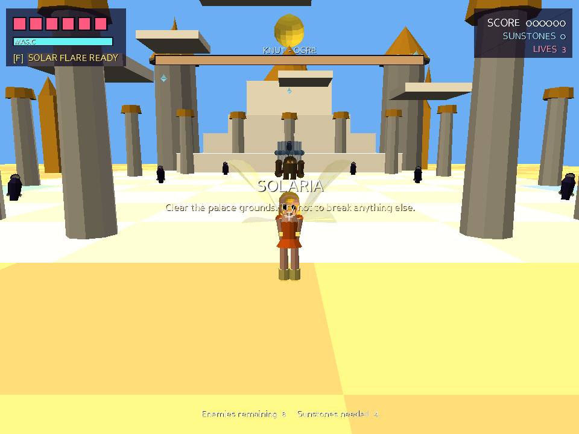

---

## Quick start

You need **Python 3.8 or newer**. Then:

```sh
pip install -r requirements.txt
python3 main.py
```

Or use the launcher for your platform:

| Platform      | Command      |
| ------------- | ------------ |
| Linux / macOS | `./run.sh`   |
| Windows       | `run.bat`    |

The first launch spends a couple of seconds synthesising the sound effects and
music, then caches them. Later launches start immediately.

### If it runs badly (or your machine is genuinely ancient)

```sh
python3 main.py --low              # 640x480, short view distance, no AA
python3 main.py --software         # software renderer - no GPU required at all
python3 main.py --low --software --no-audio    # the most forgiving combination
```

Run `python3 main.py --help` for every option (`--fullscreen`, `--width`,
`--height`, `--no-vsync`, …).

---

## Controls

| Input                  | Action                                            |
| ---------------------- | ------------------------------------------------- |
| `W` `A` `S` `D` / arrows | Move, relative to the camera                     |
| Mouse, or `Q` / `E`    | Swing the camera                                  |
| `Shift`                | Run                                               |
| `Space`                | Jump — **hold in the air to fly**                 |
| `J` / left mouse       | Magic bolt                                        |
| `K` / right mouse      | Magic blast (close range, expensive)              |
| `F`                    | Signature spell, once the magic meter is full     |
| `Tab` / `M` / `N`      | Toggle mouse look / music / sound effects         |
| `Esc`                  | Pause, or skip dialogue  (`Q` quits to title)     |
| `F12`                  | Screenshot                                        |

Flying drains magic, and so does every spell — let the meter refill between
fights. Magic bolts softly lock on to the nearest enemy in front of you.

---

## The story

The campaign retells Season 1 across ten chapters, each opening and closing
with dialogue from the characters involved.

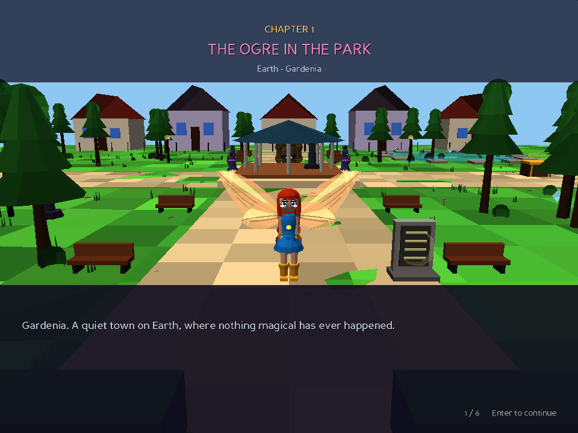

**Chapters 1 and 8 change with the fairy you pick** — they are set in *her*
realm, first at peace and later under attack. The eight chapters between and
after them are the shared Season 1 arc.

| # | Chapter | Location | Boss |
| - | ------- | -------- | ---- |
| 1 | *her own realm* | *see below* | Knut |
| 2 | College for Fairies | Alfea | — |
| 3 | Black Mud Swamp | Knut's hideout | Knut |
| 4 | The Book of Fate | Cloud Tower | Darcy |
| 5 | Lake Roccaluce | The frozen lake | Icy |
| 6 | Red Fountain | School of Heroics and Bravery | Stormy |
| 7 | Pixie Village | The great tree | Darcy |
| 8 | *her realm, besieged* | *see below* | a Trix |
| 9 | Cloud Tower Has Fallen | Cloud Tower, occupied | Icy |
| 10 | The Battle of Alfea | Alfea, besieged | Icy, Darcy **and** Stormy |

Running through it: the fairy is drawn into the war when an ogre turns up in
her home realm; at Alfea the Winx track Knut to the swamp and meet the Trix;
Bloom reads her own page in Cloud Tower's Book of Fate; Daphne tells her at
Lake Roccaluce that she is the last of Domino and carries the Dragon Flame.
The Trix take all four pieces of the **Codex** — from Alfea, Cloud Tower, Red
Fountain and Pixie Village — open the Realix dimension, and come back with the
Army of Decay, which they turn on the realms one at a time.

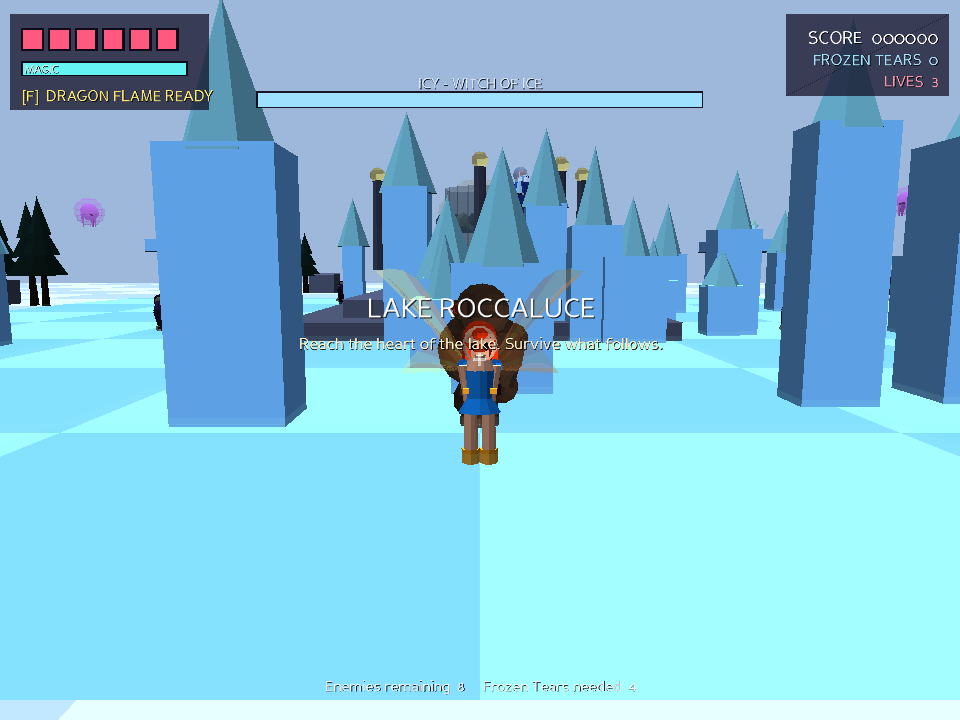
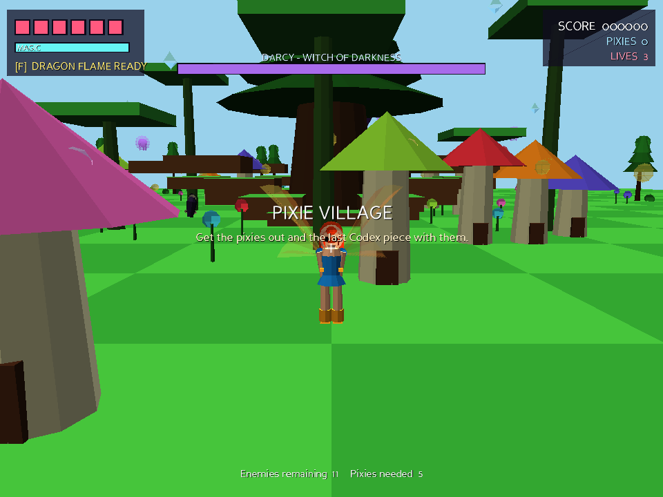
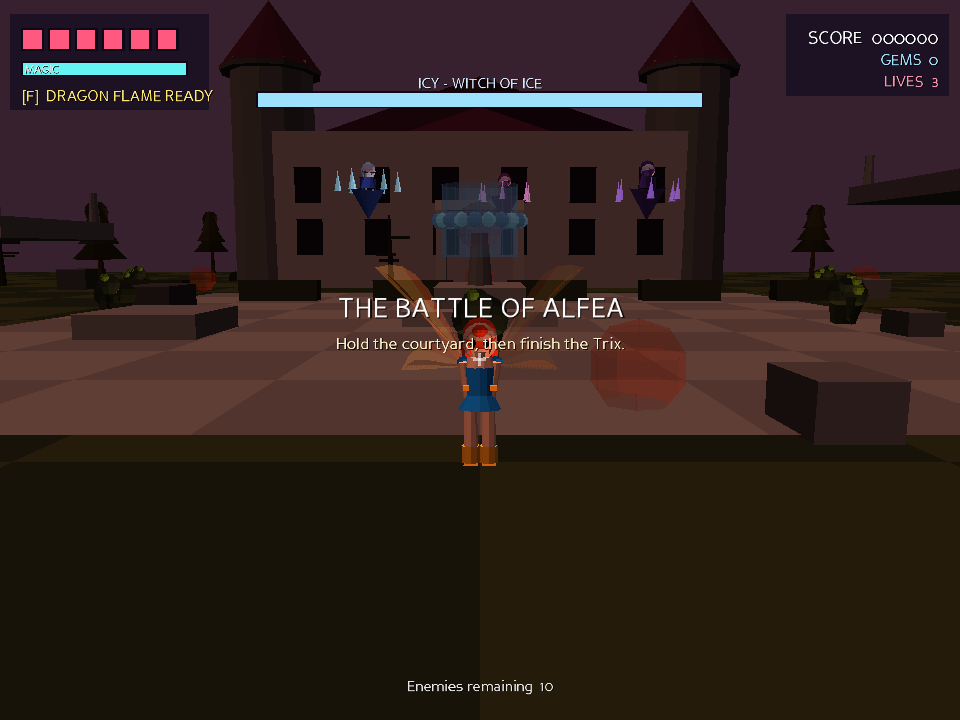

## The fairies, and their realms

Six playable fairies. Each has her own realm, her own two chapters, her own
signature spell, and her own stats and bolt pattern — Flora fires two bolts in
an arc, Tecna a three-way spread, Aisha hits hardest, Musa is quickest.

| Fairy | Realm | Chapter 1 | Chapter 8 | Signature spell |
| ----- | ----- | --------- | --------- | --------------- |
| Bloom | Earth (born on Domino) | The Ogre in the Park | They Followed You Home | Dragon Flame |
| Stella | Solaria | The Ring of Solaria | The Sun Goes Out | Solar Flare |
| Flora | Lynphea | Roots and Thorns | The Blight | Summer Blossom |
| Musa | Melody | The Silent Valley | Every String Cut | Sonic Blast |
| Tecna | Zenith | System Fault | All Systems Red | Firewall |
| Aisha | Andros | The Tide Turns | Poisoned Water | Morphix Wave |

Bloom is the exception: born on Domino, but raised in Gardenia on Earth, so
her chapters are set there — which is the premise the first season turns on.

Each realm is a distinct place, not a reskin: Solaria's marble plaza under two
suns, Lynphea's flowers grown taller than buildings, Melody's valley built as
one enormous instrument, Zenith's circuit-board grid, Andros' causeways over
open sea. Chapter 8 revisits the same realm after the Army of Decay has been
through it.

| | |
| :-: | :-: |
|  | 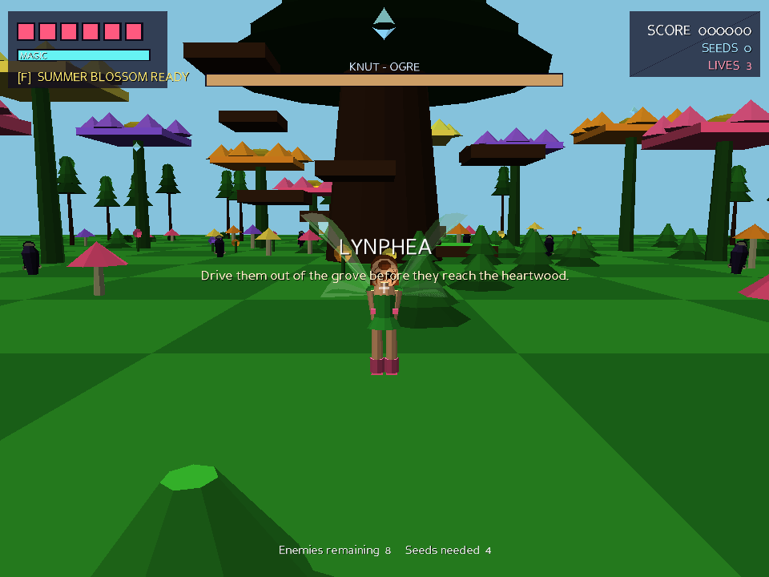 |
| **Solaria** — Stella | **Lynphea** — Flora |
| 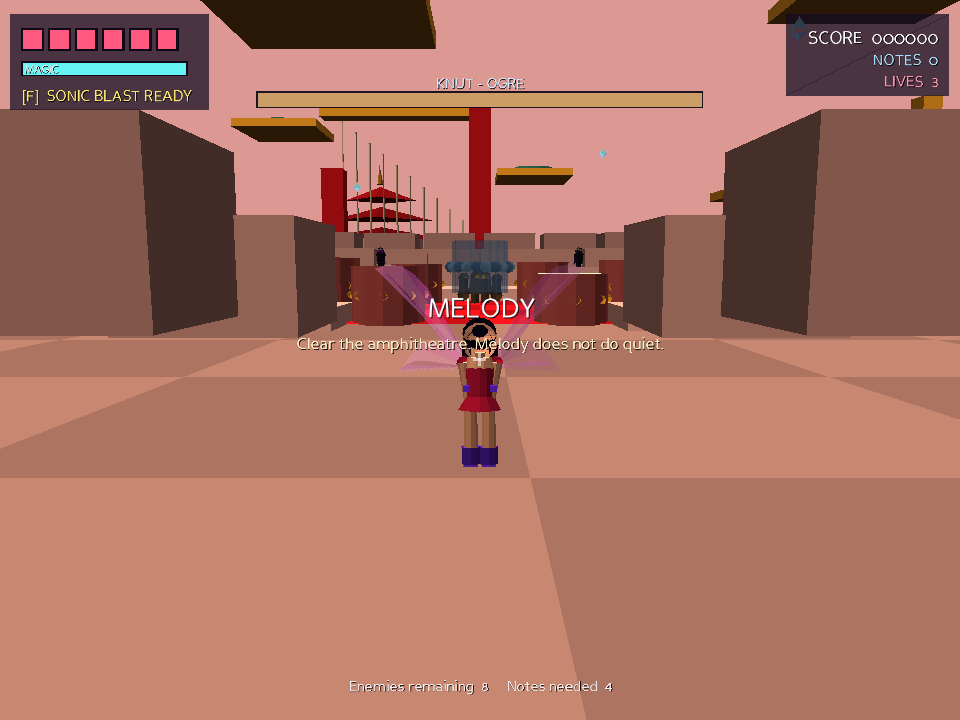 | 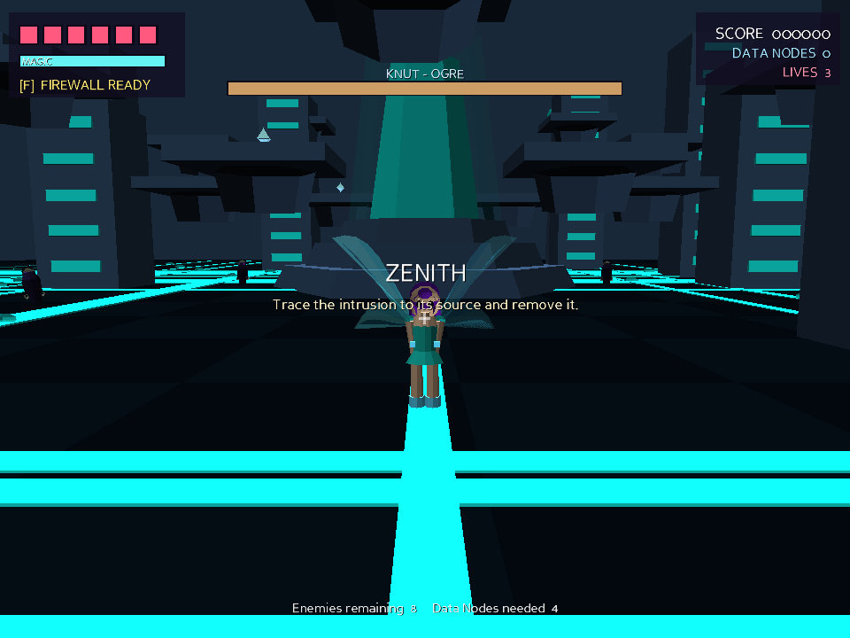 |
| **Melody** — Musa | **Zenith** — Tecna |
| 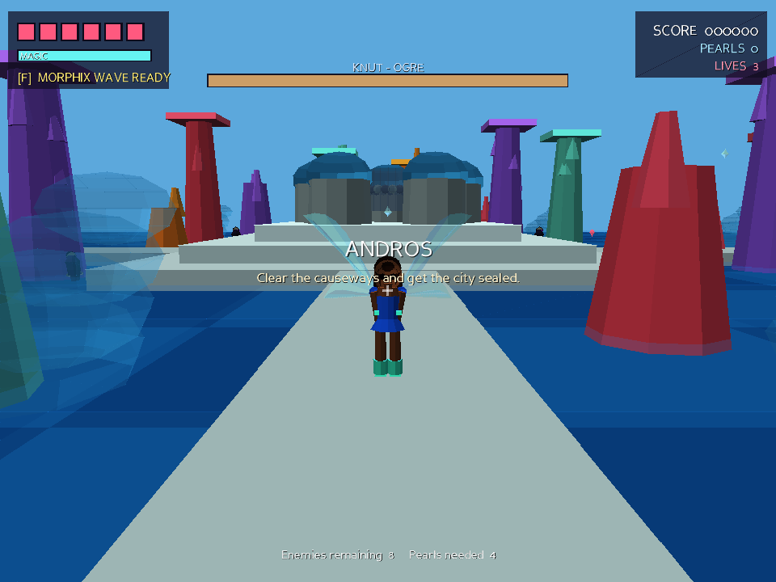 | 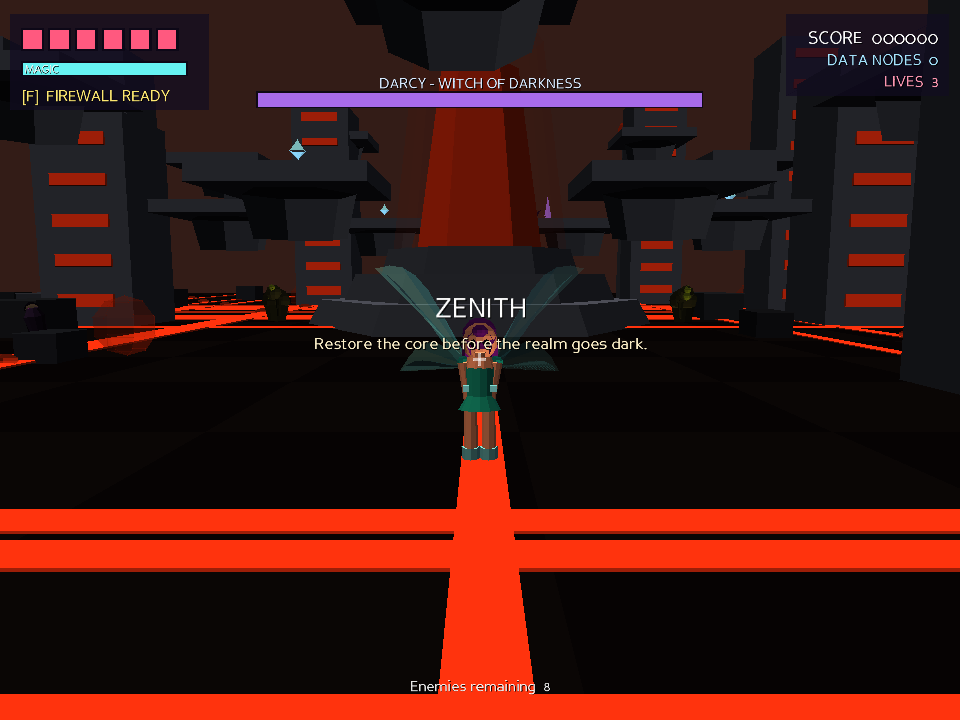 |
| **Andros** — Aisha | **Zenith**, after the Army of Decay |

Fill the magic meter and press `F` to cast your fairy's **signature spell**:
for fourteen seconds spells cost nothing, you fire faster, deal 70% more
damage and take half.

Aisha joins the Winx in their second year, so she is locked until you finish
the campaign once.

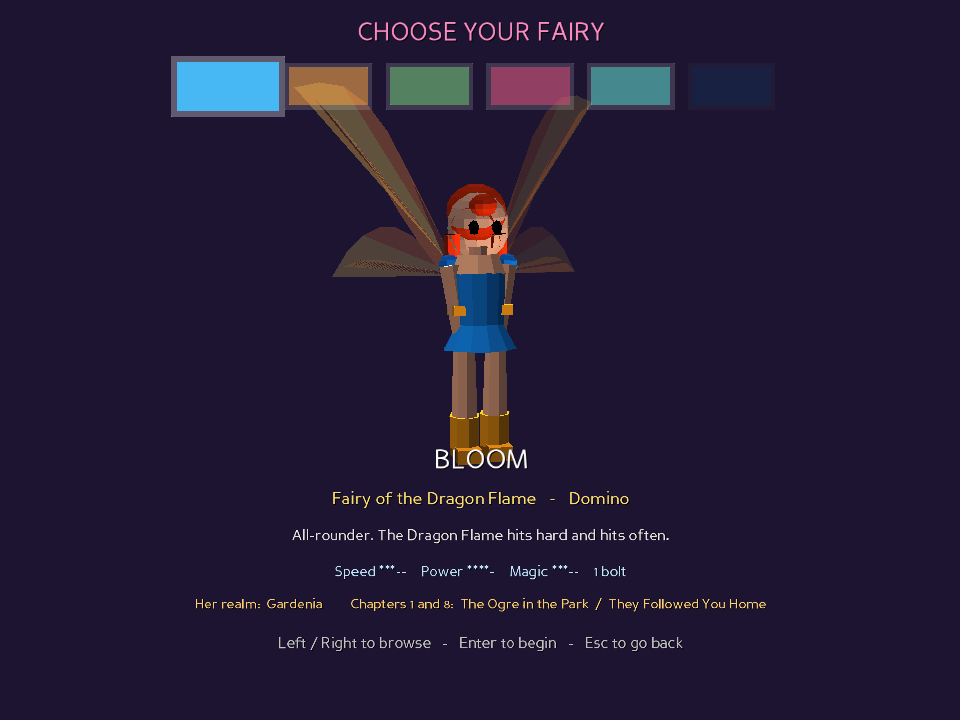

## Enemies

**Ghouls** — the Trix's foot soldiers, fast and fragile. **Wisps** — flying
ranged attackers. **Trolls** — heavy brutes that telegraph a slam. **Knut** —
the ogre, who whistles up ghouls once he is hurt. **The Army of Decay** — slow,
heavy, and it sheds rot as it comes. **The Trix** — Icy, Darcy and Stormy, each
with three attack phases keyed to her own element.

## Why Panda3D?

The brief was a 3D game that runs on old PCs and on all three desktop
platforms. Panda3D fits that better than the alternatives:

- It is the engine **Toontown Online** and **Pirates of the Caribbean Online**
  shipped on — games targeting exactly the 2003-2008 hardware the original
  Winx Club PC game ran on.
- It still supports the **fixed-function OpenGL 1.4+** pipeline, so it works on
  GPUs with no shader support. The game explicitly calls `setShaderOff()`.
- It bundles **`p3tinydisplay`**, a software rasteriser, so the game runs with
  no working GPU or 3D driver at all (`--software`).
- One `pip install`, and the same code runs on Windows, macOS and Linux.

The game also falls back automatically: it tries OpenGL, then Direct3D 9 on
Windows, then the software renderer, rather than failing to start.

### Performance choices

- **No art assets.** Every model — fairies, ghouls, toadstool houses, the
  Trix — is generated from primitives at load time (`winx3d/geometry.py`), and
  each object is baked into a single `Geom` to keep draw calls low.
- **Vertex colours instead of textures**, with baked-in shading, so there is no
  texture memory pressure and no shader cost.
- **Static level geometry is flattened** into a handful of nodes at load.
- **Analytic collision.** Movement, projectiles and pickups resolve against
  axis-aligned boxes directly rather than running Panda3D's collision
  traverser every frame.
- **Procedural audio.** Sound effects and music are synthesised to small mono
  22 kHz WAVs on first run and cached.

Consequently the repository contains no binary assets at all — it is pure
source.

---

## Layout

```
main.py               Launcher: command line, engine configuration
winx3d/
  config.py           Tunables, key bindings, the saved profile
  geometry.py         Procedural mesh builder (boxes, spheres, cylinders, ...)
  lore.py             Canon: characters, realms, the Codex, the S1 script
  characters.py       The six fairies, their models and the animator
  world.py            Level geometry, collision, realms and the campaign
  player.py           Movement, flight, combat, third-person camera
  enemies.py          Ghoul / Wisp / Troll / Decay / Knut / Trix AI
  effects.py          Projectiles, particles, pickups
  hud.py              Heads-up display
  audio.py            Sound and music synthesis
  app.py              Screens, level flow, the frame loop
tests/smoke.py        Headless playthrough test (no display needed)
tools/capture.py      Renders the screenshots in this README
```

Progress, options and your high score are saved to a per-user directory
(`%APPDATA%` on Windows, `~/Library/Application Support` on macOS,
`$XDG_DATA_HOME` or `~/.local/share` on Linux).

---

## Development

The whole game can be played through with no display attached, which is how it
is tested:

```sh
python3 tests/smoke.py      # 103 checks: lore integrity, all six campaigns
                            # and every home realm, menus, unlocks, the story
                            # system, movement, collision, flight, combat,
                            # pickups, death, portals, the Trix, teardown
python3 tools/capture.py    # regenerate screenshots/
```

---

## Notes

This is an unofficial, non-commercial fan project, written from scratch. *Winx
Club* is a trademark of Rainbow S.p.A.; this project is not affiliated with or
endorsed by them, and contains no assets from any official game.
