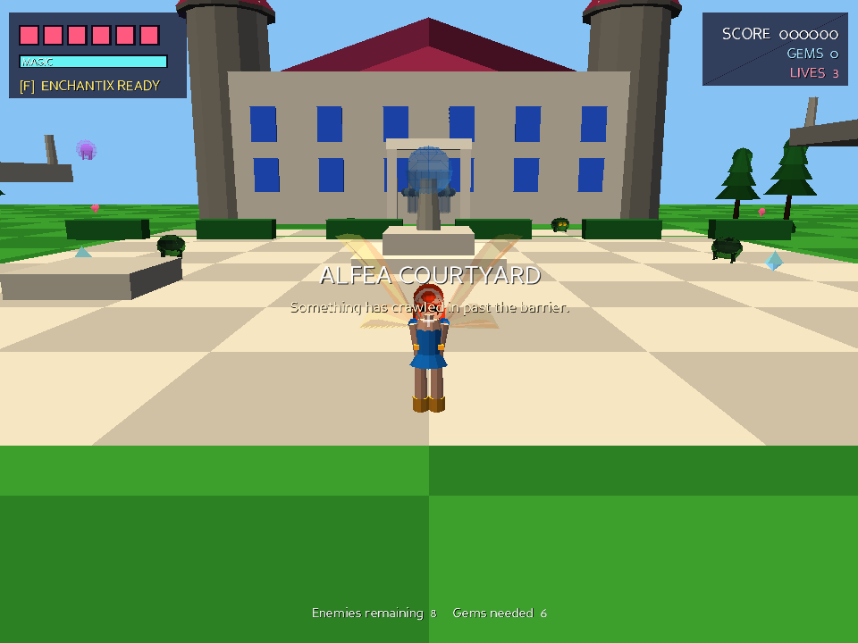
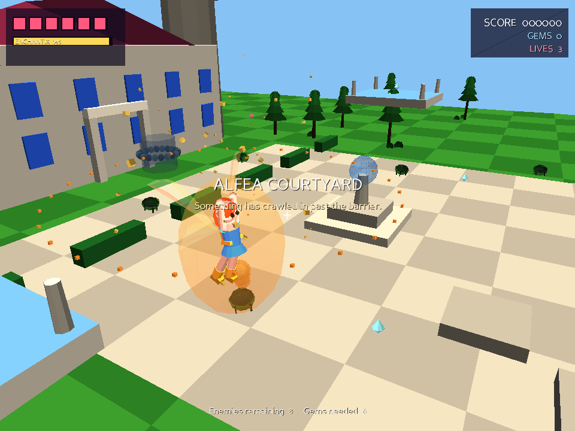
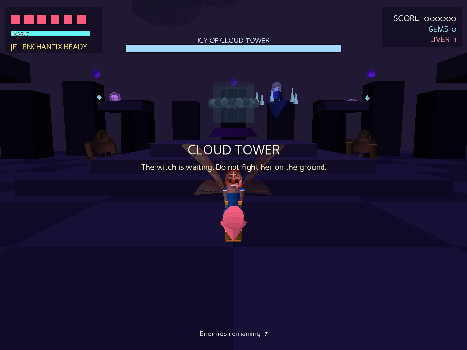

# Winx Club: Magic of Alfea

A 3D third-person action-adventure fan game, built in the spirit of the 2004
Konami *Winx Club* PC game: pick a fairy, explore an arena, blast monsters with
magic, fly, transform, and beat the witch at the top.

It runs on **Windows, macOS and Linux**, and it is deliberately built to run on
*old* hardware — the same class of machine the original shipped on.



---

## Quick start

You need **Python 3.8 or newer**. Then:

```sh
pip install -r requirements.txt
python3 main.py
```

Or use the launcher for your platform:

| Platform      | Command      |
| ------------- | ------------ |
| Linux / macOS | `./run.sh`   |
| Windows       | `run.bat`    |

The first launch spends a couple of seconds synthesising the sound effects and
music, then caches them. Later launches start immediately.

### If it runs badly (or your machine is genuinely ancient)

```sh
python3 main.py --low              # 640x480, short view distance, no AA
python3 main.py --software         # software renderer - no GPU required at all
python3 main.py --low --software --no-audio    # the most forgiving combination
```

Run `python3 main.py --help` for every option (`--fullscreen`, `--width`,
`--height`, `--no-vsync`, …).

---

## Controls

| Input                  | Action                                            |
| ---------------------- | ------------------------------------------------- |
| `W` `A` `S` `D` / arrows | Move, relative to the camera                     |
| Mouse, or `Q` / `E`    | Swing the camera                                  |
| `Shift`                | Run                                               |
| `Space`                | Jump — **hold in the air to fly**                 |
| `J` / left mouse       | Magic bolt                                        |
| `K` / right mouse      | Magic blast (close range, expensive)              |
| `F`                    | Enchantix, once the magic meter is full           |
| `Tab` / `M` / `N`      | Toggle mouse look / music / sound effects         |
| `Esc`                  | Pause  (`Q` from the pause screen quits to title) |
| `F12`                  | Screenshot                                        |

Flying drains magic, and so does every spell — let the meter refill between
fights. Magic bolts softly lock on to the nearest enemy in front of you.

---

## The game

**Six playable fairies**, each with different speed, power, magic regeneration
and bolt pattern — Flora fires two bolts in an arc, Tecna fires a three-way
spread, Aisha hits hardest, Musa is the quickest.


**Three levels**, each with its own enemies, music and objective:

1. **Alfea Courtyard** — clear the swarming creepers, gather gems from the
   terraces (you will need to fly), then take the portal.
2. **Whispering Wood** — trolls in the ruins, wisps in the canopy, and a
   climb up floating platforms to the portal at the top.
3. **Cloud Tower** — a boss fight against Icy across three attack phases:
   spread volleys, a shard ring with summoned reinforcements, and a homing
   barrage.

**Enchantix**: fill the magic meter and press `F`. For fourteen seconds spells
cost nothing, you fire faster, deal 70% more damage, and take half.




---

## Why Panda3D?

The brief was a 3D game that runs on old PCs and on all three desktop
platforms. Panda3D fits that better than the alternatives:

- It is the engine **Toontown Online** and **Pirates of the Caribbean Online**
  shipped on — games targeting exactly the 2003-2008 hardware the original
  Winx Club PC game ran on.
- It still supports the **fixed-function OpenGL 1.4+** pipeline, so it works on
  GPUs with no shader support. The game explicitly calls `setShaderOff()`.
- It bundles **`p3tinydisplay`**, a software rasteriser, so the game runs with
  no working GPU or 3D driver at all (`--software`).
- One `pip install`, and the same code runs on Windows, macOS and Linux.

The game also falls back automatically: it tries OpenGL, then Direct3D 9 on
Windows, then the software renderer, rather than failing to start.

### Performance choices

- **No art assets.** Every model — fairies, enemies, buildings, trees, the
  boss — is generated from primitives at load time (`winx3d/geometry.py`), and
  each object is baked into a single `Geom` to keep draw calls low.
- **Vertex colours instead of textures**, with baked-in shading, so there is no
  texture memory pressure and no shader cost.
- **Static level geometry is flattened** into a handful of nodes at load.
- **Analytic collision.** Movement, projectiles and pickups resolve against
  axis-aligned boxes directly rather than running Panda3D's collision
  traverser every frame.
- **Procedural audio.** Sound effects and music are synthesised to small mono
  22 kHz WAVs on first run and cached.

Consequently the repository contains no binary assets at all — it is pure
source.

---

## Layout

```
main.py               Launcher: command line, engine configuration
winx3d/
  config.py           Tunables, key bindings, the saved profile
  geometry.py         Procedural mesh builder (boxes, spheres, cylinders, ...)
  characters.py       The six fairies, their models and the animator
  world.py            Level geometry, collision boxes, the three level defs
  player.py           Movement, flight, combat, third-person camera
  enemies.py          Creeper / Wisp / Troll / Witch AI
  effects.py          Projectiles, particles, pickups
  hud.py              Heads-up display
  audio.py            Sound and music synthesis
  app.py              Screens, level flow, the frame loop
tests/smoke.py        Headless playthrough test (no display needed)
tools/capture.py      Renders the screenshots in this README
```

Progress, options and your high score are saved to a per-user directory
(`%APPDATA%` on Windows, `~/Library/Application Support` on macOS,
`$XDG_DATA_HOME` or `~/.local/share` on Linux).

---

## Development

The whole game can be played through with no display attached, which is how it
is tested:

```sh
python3 tests/smoke.py      # 59 checks: menus, movement, collision, flight,
                            # combat, pickups, death, portals, boss, teardown
python3 tools/capture.py    # regenerate screenshots/
```

---

## Notes

This is an unofficial, non-commercial fan project, written from scratch. *Winx
Club* is a trademark of Rainbow S.p.A.; this project is not affiliated with or
endorsed by them, and contains no assets from any official game.
